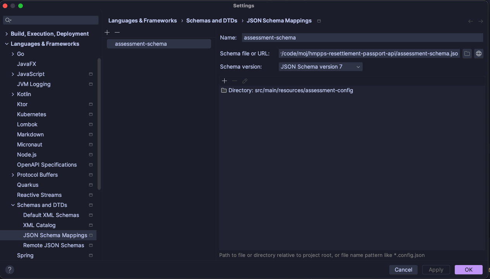

# hmpps-resettlement-passport-api

# Resettlement Passport API

This is a Backend-For-Frontend style API that support both the
[Prepare someone for release](https://github.com/ministryofjustice/hmpps-resettlement-passport-ui)
and [Plan your future](https://github.com/ministryofjustice/hmpps-resettlement-passport-person-on-probation-ui)
frontends

## Running locally

### Starting the API
* Start the database, stubs and dependencies with `docker compose -f docker-compose-local.yml up -d`
* Make sure to set environment variables for `RESETTLEMENT_PASSPORT_API_CLIENT_ID` and `RESETTLEMENT_PASSPORT_API_CLIENT_SECRET`
* Start with `gradle bootrun --args='--spring.profiles.active=dev'` or use a run profile in Intellij (using the dev profile)

## Yaml autocomplete/validation
### Setting up the schema association
Questions for a Prepare someone for release report are defined in yaml, see for example [accommodation-assessment-v1.yml](src/main/resources/assessment-config/accommodation/accommodation-assessment-v1.yml)

To get autocomplete for these files in intelliJ you can use the [assessment-schema.json](assessment-schema.json)

Add it as a JSON schema mapping in Languages and Frameworks -> Schemas and DTDs -> JSON Schema Mappings

### Regenerating the schema
If the yaml structure changes, rerun the `GenerateAssessmentSchema` file and commit the changes.

## Testing wiremock stubs locally
- build the docker image: `docker build -f stubs.Dockerfile -t stubs .`
- run the stubs locally on port 8080: `docker run -p 8080:8080 stubs`
- test it, for example: `http://localhost:8080/resettlement-passport-and-delius-api/appointments/U338861`
