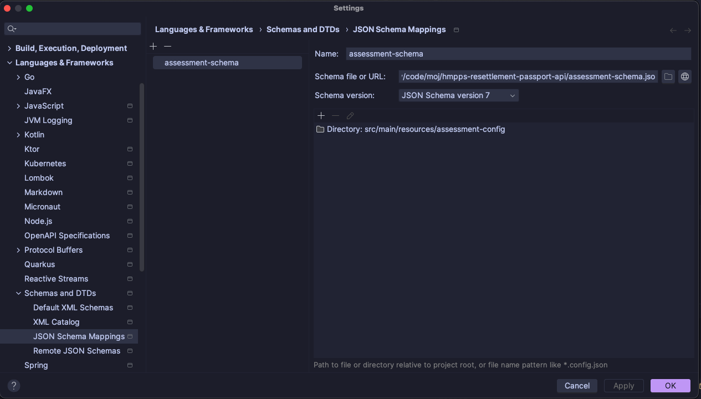

# hmpps-resettlement-passport-api
[](https://github-community.service.justice.gov.uk/repository-standards/hmpps-resettlement-passport-api)
[](https://ghcr.io/ministryofjustice/hmpps-resettlement-passport-api)
[](https://resettlement-passport-api-dev.hmpps.service.justice.gov.uk/swagger-ui/index.html)
[![Pipeline [test -> build -> deploy]](https://github.com/ministryofjustice/hmpps-resettlement-passport-api/actions/workflows/pipeline.yml/badge.svg?branch=main)](https://github.com/ministryofjustice/hmpps-resettlement-passport-api/actions/workflows/pipeline.yml)

# Resettlement Passport API

This is a Backend-For-Frontend style API that support both the
[Prepare someone for release](https://github.com/ministryofjustice/hmpps-resettlement-passport-ui)
and [Plan your future](https://github.com/ministryofjustice/hmpps-resettlement-passport-person-on-probation-ui)
frontends

## Running locally

### Starting the API
* Start the database, stubs and dependencies with 
```shell
docker compose -f docker-compose-local.yml up -d
```
* Make sure to set environment variables for `RESETTLEMENT_PASSPORT_API_CLIENT_ID` and `RESETTLEMENT_PASSPORT_API_CLIENT_SECRET`
* Start with 
```shell
gradle bootrun --args='--spring.profiles.active=dev'
```
or use a run profile in IntelliJ (using the dev profile)

## Yaml autocomplete/validation
### Setting up the schema association
Questions for a Prepare someone for release report are defined in yaml, see for example [accommodation-assessment-v1.yml](src/main/resources/assessment-config/accommodation/accommodation-assessment-v1.yml)

To get autocomplete for these files in intelliJ you can use the [assessment-schema.json](assessment-schema.json)

Add it as a JSON schema mapping in Languages and Frameworks -> Schemas and DTDs -> JSON Schema Mappings



### Regenerating the schema
If the yaml structure changes, rerun the `GenerateAssessmentSchema` file and commit the changes.

## Testing wiremock stubs locally
- build the docker image: 
```shell
docker build -f stubs.Dockerfile -t stubs .
```
- run the stubs locally on port 8080: 
```shell
docker run -p 8080:8080 stubs
```
- test it, for example: `http://localhost:8080/resettlement-passport-and-delius-api/appointments/U338861`

## Run docker image on local

### Build a local docker image
1. Build the app jar
2. Copy jar to project root
3. Build docker image

```shell
BUILD_NUMBER=1_0_0 ./gradlew clean assemble && cp ./build/libs/*.jar .
```
```shell
BUILD_NUMBER=1_0_0 docker build --build-arg BUILD_NUMBER=$BUILD_NUMBER . -t "hmpps-resettlement-passport-api:local"
```

### Run a local docker image
* In `.env.docker` (with `dev` profile)
    ```dotenv
    UK_PRN=...
    ORG_PASSWORD=...
    VENDOR_ID=...
    PFX_FILE_PASSWORD=...
    SPRING_PROFILES_ACTIVE=dev
    # `host.docker.internal` (instead of `localhost`) for connecting the container to host 
    HMPPS_SQS_LOCALSTACKURL=http://host.docker.internal:4566
    ```

then run this
```shell
docker run --name hmpps-resettlement-passport-api-app --env-file .env.docker -p 8080:8080 -d "hmpps-resettlement-passport-api:local"
```
